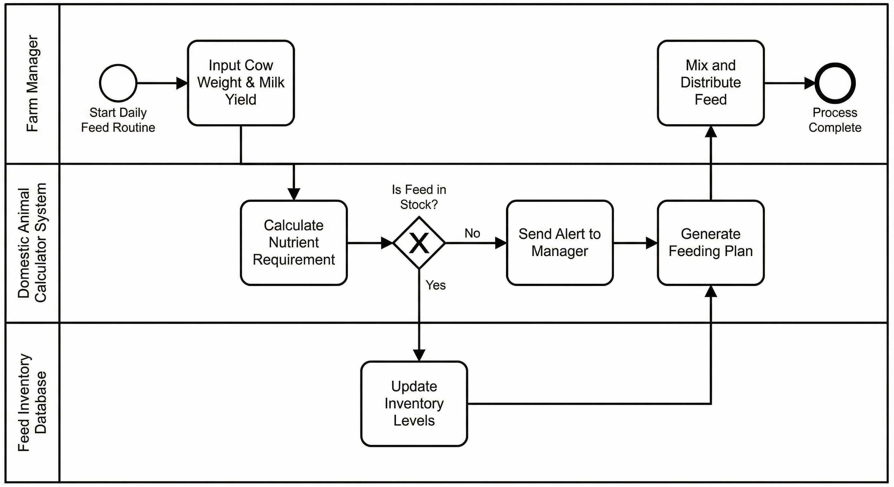

# Business Process Model: Precision Ration Formulation

**Project:** The Domestic Animal Calculator (Cow)
**Date:** December 9, 2025
**Group:** SUGI GISELE

---

### 1. Process Overview
**Process Name:** Daily Ration Calculation & Yield Analysis.
**Objective:** To automate the complex calculation of nutritional requirements for dairy cows based on their daily performance, ensuring optimal milk production and cost efficiency.

### 2. Diagram

*(Ensure your image file is named exactly Process_Diagram.png for this to show up)*

### 3. Key Entities & Roles
| Entity | Role |
| :--- | :--- |
| **Farm Manager** | Primary user responsible for data input and physical feeding. |
| **Calculator System** | The PL/SQL engine that processes formulas and checks logic. |
| **Feed Inventory DB** | The database tracking stock levels of silage and grain. |

### 4. Logic & Flow
1. **Input:** The manager enters the cow's weight and milk yield.
2. **Calculation:** The system calculates the exact nutrients required using PL/SQL formulas.
3. **Inventory Check:** A decision point checks if the required feed is in stock.
   - *If Yes:* A feeding plan is generated.
   - *If No:* An alert is sent to the manager.
4. **Execution:** The inventory is updated, and the manager feeds the cow.

### 5. MIS Relevance
This process is critical for **Inventory Management** and **Decision Support**. It moves the farm from reactive management to proactive optimization, reducing feed wastage by an estimated 10-15%.
